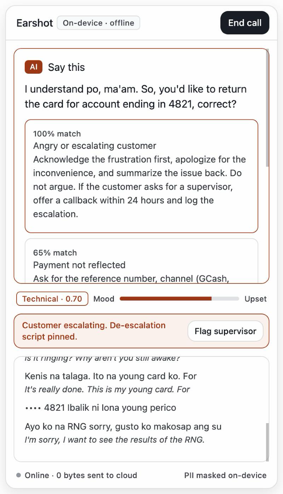

# Earshot

On-device AI copilot for Philippine call center agents. It transcribes the call, pulls up the right procedure from the company knowledge base as the customer talks, and drafts the after-call notes. **Everything runs on the agent's computer, so customer data never leaves the machine.**

Built for AppBuildersPH Hackathon 2026 (theme: Local AI).



## What it does
A floating panel (always on top, Cmd+\ to hide) next to the agent's CRM:
- **Live Taglish transcript** with an **English subtitle** under each line.
- **PII masked as it's spoken:** card numbers, phone numbers, account numbers and emails show as `•••• 4821` before any text reaches the UI, search or notes.
- **Intent + mood every 5 s:** an intent chip and a mood meter; when the customer stays upset, an **escalation banner** pins the de-escalation procedure.
- **Right procedure, mid-call:** knowledge-base search over `engine/kb/*.md`, plus a drafted **"Say this"** reply grounded in it.
- **After-call notes:** category / priority / disposition (dropdowns with confidence), summary and follow-up, editable, **Copy to CRM**.
- **Demo call:** the header button streams `engine/demo/call.wav` (a 64 s Taglish double-charge call voiced with ElevenLabs, built by `engine/demo/elevenlabs/build.sh`; the older macOS `say` version is `call-tts.wav`) through the same pipeline, so the demo never depends on a live mic.

## Why local
BPO clients forbid pasting customer data into cloud AI tools (client contracts, Data Privacy Act RA 10173). Agents need suggestions in real time, mid-call. Local inference makes both possible: no data egress, no per-call API cost, works with the network unplugged.

Measured on the demo MacBook (M5, 24 GB), per 5 s audio chunk: Whisper ~0.4 s, English subtitle 0.4–0.8 s, Laya intent + mood + KB search ~0.07 s, "say this" reply 0.5–1.2 s. That's under 2.5 s of work per 5 s of audio, so it keeps up with the call; each line appears ~0.4 s after it's spoken. Notes take ~2 s after the call ends. Models load in ~15–25 s at startup.

## Stack
| Layer | Tech |
|---|---|
| Desktop app | Tauri 2 + SvelteKit (Svelte 5) |
| AI engine | Python 3.12, FastAPI on `127.0.0.1:8765` |
| Speech-to-text | Whisper large-v3-turbo via `mlx-whisper` |
| Knowledge-base search | EmbeddingGemma 2 (text-only, 270M) via `sentence-transformers` |
| Live typed decisions (intent, mood) | Laya multilingual (322M) via the `laya` package (PyTorch, Apple GPU) |
| Reply + call notes | Gemma 4 E4B (4-bit MLX) via `mlx-vlm` |

Demo hardware: MacBook (Apple M5, 24 GB). Windows path (whisper.cpp + llama.cpp behind the same engine API) is planned, not built.

## What runs locally / what needs internet
- **Local (works with Wi-Fi off):** everything at call time. Speech-to-text (Whisper), English subtitles, "say this" replies and note summaries (Gemma 4 E4B), live intent + mood and the note dropdowns (Laya), knowledge-base search (EmbeddingGemma 2), PII masking (regex in the engine), the demo call, the UI. The app only talks to its own engine on `127.0.0.1:8765`; the footer shows Online/Offline next to "0 bytes sent to cloud".
- **Internet:** only for setup: downloading model weights once (`engine/fetch_models.sh`, from ModelScope) and installing packages (`uv sync`, `pnpm install`, Rust crates). At runtime the engine sets `HF_HUB_OFFLINE`, `TRANSFORMERS_OFFLINE` and `HF_HUB_DISABLE_TELEMETRY`, and the app starts it with `uv run --offline`.

## Run it
Requires macOS on Apple Silicon, [uv](https://docs.astral.sh/uv/), pnpm, Rust.

```bash
./engine/fetch_models.sh          # ~9 GB into ~/models, from ModelScope
cd engine && uv sync && cd ..
cd app && pnpm install && pnpm tauri dev
```
`pnpm tauri dev` starts the engine automatically; the first launch takes ~20 s to load models (badge: "Loading models…" → "On-device · offline"). Then click **Demo call**, or **Start call** to use the mic.

Engine only: `cd engine && uv run uvicorn server:app --port 8765`, then `curl 127.0.0.1:8765/health`. Checks without models: `uv run python test_masking.py` (also `test_signals.py`, `test_chunking.py`).

More screenshots: `docs/phase-*.png`.

## Disclosures
- **Models:** Whisper large-v3-turbo (OpenAI, MIT, MLX conversion by mlx-community), EmbeddingGemma 2 (Google, Apache 2.0), Gemma 4 E4B-it 4-bit MLX (Google, Apache 2.0; conversion by mlx-community), Laya multilingual (Convai Innovations, Apache 2.0).
- **Frameworks:** Tauri, SvelteKit, FastAPI, MLX, mlx-whisper, mlx-vlm, sentence-transformers, PyTorch.
- **Cloud APIs:** the demo-call audio was voiced once with ElevenLabs (via Puter) during the build; nothing calls the cloud at runtime.
- **Design reference:** `DESIGN.md` from getdesign.md (Airtable analysis), used as a style starting point.
- **Prior work:** the idea of AI call classification is inspired by the team's earlier Neosolve project (Agora Voice AI Hackathon); no code reused.
- **AI dev tools:** Claude Code.
